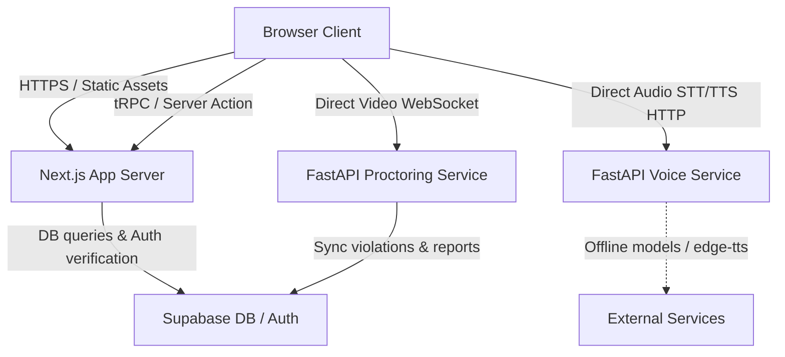

# System Architecture

The **AIML Interview System** is organized as a multi-service monorepo. It connects a modern Next.js client, a real-time audio service, a computer-vision cheating detection service, and a database to deliver an end-to-end AI-powered proctored interview.

## Service Components

### 1. Frontend Client (`/frontend`)
- **Technology Stack**: Next.js (React 18), Tailwind CSS, Framer Motion, tRPC, Supabase Client SDK.
- **Role**:
  - Manages student/candidate auth via Supabase Auth.
  - Controls the setup onboarding flow (permissions checkout for camera, microphone, screen share).
  - Performs **client-side face and object tracking** using TensorFlow.js (`@tensorflow/tfjs`, `@tensorflow-models/blazeface`, and `@tensorflow-models/coco-ssd`) inside the browser for lightweight, immediate local feedback.
  - Implements the interview dashboard, incorporating a text-to-speech speaker, voice recording mic, custom whiteboard, and a monaco-based code editor.

### 2. Voice Backend Service (`/backend`)
- **Technology Stack**: FastAPI (Python 3.11), Uvicorn, Whisper (`faster-whisper`), Edge TTS (`edge-tts`).
- **Role**:
  - Exposes REST endpoints on port `8001` for audio processing.
  - **Speech-to-Text (`/api/speech/transcribe`)**: Receives the candidate's audio webm recording, processes it locally using Whisper, and returns the transcribed text.
  - **Text-to-Speech (`/api/tts/speak`)**: Synthesizes the AI interviewer's text response into audio MP3 stream using Microsoft's Edge TTS.

### 3. AI Proctoring Service (`/python-cheating-system`)
- **Technology Stack**: FastAPI (Python 3.11), WebSocket, OpenCV, MediaPipe, Ultralytics YOLOv8.
- **Role**:
  - Exposes REST and WebSocket endpoints on port `8000`.
  - Runs advanced server-side anti-cheating logic (e.g. gaze tracking, multiple person detection, phone/book detection).
  - Handles client-side events injected via `/api/sessions/{session_id}/event` (tab switching, window focus loss, exiting full-screen).
  - Synchronizes violation records and candidate reports to Supabase DB.
  - Compiles PDF report summaries on stop.

### 4. Supabase (`/supabase`)
- **Technology Stack**: PostgreSQL, Supabase GoTrue Auth, Realtime database.
- **Role**:
  - Handles user authentication and role management.
  - Houses the core database schema (Interviews, Sessions, Messages, Violations, Usage stats).
  - Configures local Supabase development environment via CLI migrations.

## Interactive Flow

1. **Setup**: The candidate logs into the Next.js frontend, completes onboarding checks (verifies mic, speaker, and camera).
2. **Session Start**: The client triggers the interview, loading questions and context. The local browser starts TFJS-based facial and device verification. Simultaneously, the frontend starts a proctoring session on the proctoring server.
3. **Conversational Loop**:
   - The candidate speaks. The recorded audio segment is POSTed to the Voice Backend (`/api/speech/transcribe`).
   - The returned transcription is sent to Next.js (`/api/ai/chat`) to generate the next response.
   - The generated AI response text is POSTed to the Voice Backend (`/api/tts/speak`) to synthesize voice audio, which plays back in the browser.
4. **Proctoring**:
   - If the candidate switches tabs, exits full-screen, or is flagged by TFJS detection, the client injects violation events to the Proctoring Server.
   - The Proctoring Server tracks violations and broadcasts status updates via WebSockets.
5. **Session End**: Next.js flags the interview as complete. The evaluation results are compiled, and a detailed candidate report is generated and saved in Supabase.
